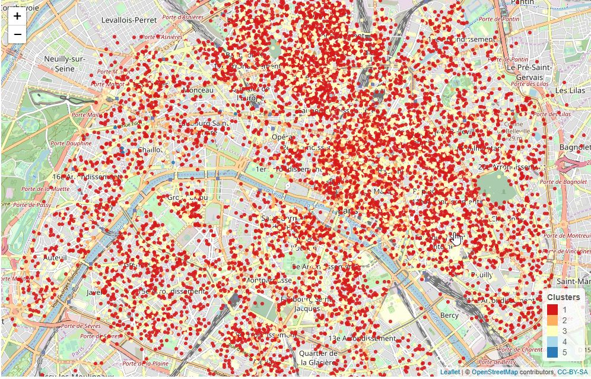
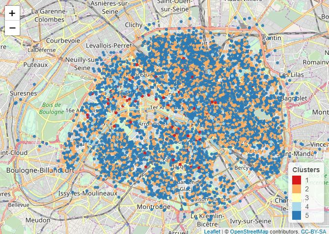
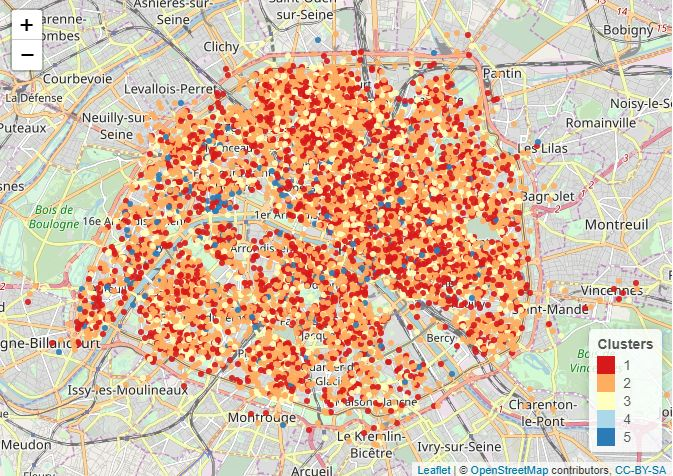

```{r setup, include=FALSE}
knitr::opts_chunk$set(echo = TRUE)
```

The goal of this study is to cary out unsupervised clustering on Airbnb listing data in Paris. We will use hierarchical clustering and K-means plus PCA for the visualization.

## Loading data

```{r}
load('AirBnB-Paris-small.Rdata')

```
## Descriptive analysis


```{r}
summary(X)


```

There are 10000 observations of 63 variables. There are 32 numeric variables and the remaining ones are factors or logical variables. 

Keeping only apartments

```{r}
# filtering only apartments:
A <- X[X$property_type == 'Apartment',]

```


All the columns related to price display prices in character format, prefixed by "$" and with "," for thousand delimiter. We will convert below those colums from characters to numeric using as.numeric and gsub functions.  

```{r}
# Changing the price columns from character to numeric 
A$price <- as.numeric(gsub('\\$|,', '', A$price))
A$weekly_price <- as.numeric(gsub('\\$|,', '', A$weekly_price))
A$monthly_price <- as.numeric(gsub('\\$|,', '', A$monthly_price))
A$security_deposit <- as.numeric(gsub('\\$|,', '', A$security_deposit))
A$cleaning_fee <- as.numeric(gsub('\\$|,', '', A$cleaning_fee))
A$extra_people <- as.numeric(gsub('\\$|,', '', A$extra_people))
```

In the section below, we will:      
* Drop columns with only missing values   
* For all numeric columns, replace missing value with median   column value    
* double check that there is no remaining missing values   

```{r}
# Checking missing values
#colSums(is.na(A))
#drop columns neighbourhood_group_cleansed and has_availability
# as they are empty
A$neighbourhood_group_cleansed <- NULL
A$has_availability <- NULL

# replace missing numerical values by the column median 
nums <- unlist(lapply(A, is.numeric)) 
for (nm in names(nums)){
  #print(nm)
  #print(nums[[nm]])
  if ( nums[[nm]] ){
     myna <- is.na(A[[nm]])
     mycol <- A[[nm]]
     #mycol[myna] <- mean(A[[nm]],na.rm = TRUE)
     mycol[myna] <- median(A[[nm]],na.rm = TRUE)
     A[[nm]] <- mycol

  }
}

# double check that there is no missing values
colSums(is.na(A))

```
Check that there his no issue with the processed data by plotting an histogram of price variable. 

```{r}
hist(A$price, breaks = 50,freq=FALSE)

```


### Filter the features
We will only keep the numeric features  


```{r}
nums <- unlist(lapply(A, is.numeric)) 
B <- A[,nums]


```

## Clustering


### Hierarchical clustering - Ward distance


Hierarchical clustering shows visually 5 main clusters. 

```{r}
D <- dist(B)
out <- hclust(D,method = "ward.D2")  # Using Ward distance
plot(out)

K1 = 5
res1 = cutree(out, K1)
rect.hclust(out,K1)

```
   
The visualization is not very good. We only  see clearly the main  4 clusters. 

We can also display the clustering using a map.  

```{r}
#install.packages('leaflet')
library(leaflet)

palette = colorFactor("RdYlBu", domain = NULL)
leaflet(B) %>% addTiles() %>% addCircleMarkers(radius = 3, color =
     palette(res1),stroke = FALSE, fillOpacity = 0.9) %>%
  addLegend("bottomright", pal = palette, values = res1,
    title = "Clusters",
    opacity = 1
  )
#palette(c(seq(K1))),stroke = FALSE, fillOpacity = 0.9)
#%>% addTiles() %>% addCircleMarkers(radius = 3, color = palette(out),stroke = FALSE, fillOpacity = 0.9)

```
   
We see that there is one big cluster (cluster 1) and other smaller clusters (2, 3). The clusters generally are not tied to a specific Paris location, except for the cluster 5 that is located on the 16th district.   


Here is a picture of the rendering: 



### Hierarchical clustering - other distances  
* Single distance   
```{r}
#D <- dist(B)
out <- hclust(D,method = "single")  # Using single distance
plot(out)

K1 = 5
res1 = cutree(out, K1)
rect.hclust(out,K1)


```
We see basically a single cluster, the result is not good.  

* Centroid distance  


```{r}
out <- hclust(D,method = "centroid")  # Using centroid distance
plot(out)

K1 = 5
res1 = cutree(out, K1)
rect.hclust(out,K1)

```

Again, we see a single cluster, and we can confirm that the custering generated is not good.  

* Complete distance  

```{r}
out <- hclust(D,method = "complete")  # Using complete distance
plot(out)

K1 = 5
res1 = cutree(out, K1)
rect.hclust(out,K1)


```
   
Here we are able to identify 2 clusters, but it's still a very unbalanced clustering. 


### k-means clustering

We apply the k-mean clustering with 5 clusters as suggested by the hierarchical clustering. 

```{r}
library(class)
set.seed(1234)
outk = kmeans(B,5, nstart= 15)
#outk

```
We see that the between class sum of squares divided by the total sum of squares is 66.7 %. 


```{r}
palette = colorFactor("RdYlBu", domain = NULL)
leaflet(B) %>% addTiles() %>% addCircleMarkers(radius = 3, color =
     palette(outk$cluster),stroke = FALSE, fillOpacity = 0.9) %>%
  addLegend("bottomright", pal = palette, values = outk$cluster,
    title = "Clusters",
    opacity = 1
  )


```

We see that the KMeans clustering is more balanced. And we also notice that cluster 5 is more located on the West area (16th - 17th district).





Next we will evaluate the best k for the k-means algorithm  

```{r}
J = c()
for (k in 1:15){
  out = kmeans(B,k,nstart=15)
  J[k] = out$betweenss / out$totss
}
plot(1:15,J,type='b')

```

We get the confirmation that the best k is k=5.


## Data visualization

We will use PCA to visualize the data and check dimensionality reduction. 

```{r}

out <- princomp(B,cor=TRUE)
#out = princomp(B)
Xproj <-  predict(out,B)
biplot(out)
#summary(out)
```

Variance explained plot

```{r}
var_explained <- out$sdev^2/sum(out$sdev^2)
barplot(var_explained)
```

Using the factoMiner Library

```{r}
library(FactoMineR)
out = PCA(B)
plot(out)


```

Check the number of componenents to keep: 

```{r}
out = princomp(B)
out$sdev
plot(out)
summary(out)
```


The cattell's test:
```{r}
myPCA <- function(X,d=2){
  # Covariance estimation
  Xbar = scale(X,center=TRUE,scale=FALSE)
  Sigma = 1/nrow(Xbar) * t(Xbar) %*% Xbar
  
  # Eigen-decomposition
  out = eigen(Sigma)
  
  # Return the PC axes and plot the projection
  U = out$vectors[,1:d]
  Xproj = as.matrix(X) %*% U
#  if (d <= 2) plot(Xproj,type='p',pch=19)
#  else pairs(Xproj,pch=19)
  return(list(U=U,lambda=out$values))
}
```


```{r}
out = myPCA(B)
diff = abs(diff(out$lambda))
plot(diff)
abline(h=0.1*max(diff),col='red')

```

### Retry the analysis by removing some features

Try to rerun the clustering by filtering out some of the numeric features: 


```{r include=FALSE}
# Filter the features to keep for the analysis  
#
library(tidyverse)

A %>% select("host_listings_count", "latitude", "longitude", 
          "accommodates", "bathrooms", "bedrooms", "beds",
          "square_feet","price",
          "security_deposit", "cleaning_fee", "guests_included", 
          "extra_people", "minimum_nights", "maximum_nights",
          "availability_30","number_of_reviews",
          "review_scores_rating", "review_scores_value") -> B

```

### Retry the K-Means algorithm

```{r}
set.seed(1234)
outk = kmeans(B,5, nstart= 15)
#outk

```

We have a better clustering result. 

```{r}
palette = colorFactor("RdYlBu", domain = NULL)
leaflet(B) %>% addTiles() %>% addCircleMarkers(radius = 3, color =
     palette(outk$cluster),stroke = FALSE, fillOpacity = 0.9) %>%
  addLegend("bottomright", pal = palette, values = outk$cluster,
    title = "Clusters",
    opacity = 1
  )


```




## Summary
We used unsupervised clustering algorithms on an Airbnb Paris listing dataset. Both Hierarchical clustering identified 7 as the optimal number of clusters. It was not obvious to visualize this clustering however. Afterwards we used PCA to visualize the features with higher impact. And we removed a subset of features that were not relevant according PCA and we ran K-Means again, and found a more balanced clustering.


